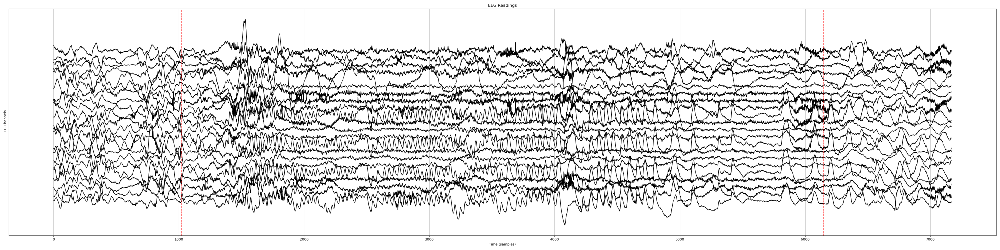

# EEG Seizure Detection

This project implements deep learning models for automated seizure detection using EEG (Electroencephalogram) data from the CHB-MIT Scalp EEG Database. The project explores various neural network architectures including LSTM, CNN-LSTM hybrids, and EEGNet for temporal seizure pattern recognition.

## Overview

The system processes EEG recordings to automatically detect seizure events by analyzing temporal patterns in brain activity. Multiple model architectures are implemented and compared, with a focus on LSTM-based approaches that can capture the sequential nature of EEG signals.

## Dataset

The project uses the [**CHB-MIT Scalp EEG Database**](https://physionet.org/content/chbmit/1.0.0/) which contains:
- EEG recordings from pediatric patients
- 23-channel EEG data sampled at 256 Hz
- Annotated seizure start and end times
- Data stored in EDF (European Data Format) files

Raw EEG Data (23 Channels)


## Chb01 Dataset (data_org folder)
All EEG files with seizure from patient chb01 are extracted to the data_org folder for quick testing.

### Data Structure
```
chb-mit-scalp-eeg-database-1.0.0/
├── chb01/
├── chb02/
├── ...
└── chb24/
```

## Project Structure

```
├── README.md
├── seizure_times.pkl                 # Preprocessed seizure timing data
├── seizure_detection_lstm_2_seconds_model.keras  # Trained model
├── 
├── Core Scripts:
├── LSTM_all_data.py                  # Train on all patients combined
├── LSTM_one_per_patient_1_minute.py  # Per-patient model (1-minute windows)
├── LSTM_one_per_patient_2_seconds.py # Per-patient model (2-second windows)
├── LSTM_chb01.py                     # Single patient (chb01) analysis
├── 
├── Utility Scripts:
├── read_edf_dataset.py               # EDF file exploration
├── read_seisure_time.py              # Seizure timing analysis
└── predict_seizure_start_time.py     # Predicting seizure start time
```

## Key Features

### 1. Data Processing
- **EDF File Loading**: Uses MNE library to read EEG data
- **Temporal Windowing**: Configurable sliding window approach
- **Data Validation**: Filters files with exactly 23 channels
- **Seizure Labeling**: Automatic labeling based on temporal overlap

### 2. Model Architectures

#### Basic LSTM Model
- Sequential LSTM layers for temporal pattern recognition
- Dropout regularization to prevent overfitting

#### Improved LSTM Model
- **CNN Feature Extraction**: TimeDistributed CNN layers for spatial feature extraction
- **Bidirectional LSTM**: Captures forward and backward temporal dependencies
- **Batch Normalization**: Stabilizes training
- **Advanced Regularization**: Multiple dropout layers

#### CNN-LSTM Hybrid
- 3D CNN for spatial-temporal pattern capture
- LSTM for sequence modeling
- Global pooling for dimensionality reduction

#### EEGNet
- Specialized CNN architecture for EEG analysis
- Depthwise convolutions for channel-specific feature extraction

### 3. Training Strategies
#### Cross-Patient Training
- Single model trained on all patients
- Better generalization across different seizure types

#### Sample one EEG file from each patient for Training (due to computational limitation)
- Individual models for different intervals (eg. 2 seconds, 1 minute)
- Accounts for patient-specific seizure patterns
- (Outliers) Excludes patients under 4 years old (chb06, chb10, chb12, chb13)


## Installation

```bash
# Install required packages
pip install mne numpy tensorflow scikit-learn pickle

# For EDF file handling
pip install pyedflib
```

## Usage

### 1. Data Preview
```python
# Explore seizure timing data 
python read_seisure_time.py

# Explore EDF dataset
python read_edf_dataset.py
```

### 2. Model Training

#### Train on one EEG file from each patient (2-second windows):
```python
python LSTM_one_per_patient_2_seconds.py
```

#### Train on one EEG file from each patient (1-minute windows):
```python
python LSTM_one_per_patient_1_minute.py
```

#### Train on all data:
```python
python LSTM_all_data.py
```

#### Single patient (chb01) analysis:
```python
python LSTM_chb01.py
```

### 3. Model Evaluation
Models are automatically evaluated with:
- **Confusion Matrix**: True/False positives and negatives
- **Classification Report**: Precision, recall, F1-score
- **Early Stopping**: Prevents overfitting during training

## Configuration Parameters

### Data Processing
- `delta`: Non-seizure data length before/after seizure (default: 100 seconds)
- `offset`: Minimum overlap for seizure classification (default: 2-10 seconds)
- `seq_len`: Sliding window length (2 seconds or 60 seconds)

### Model Training
- `batch_size`: 16
- `epochs`: 30-50 with early stopping
- `validation_split`: 0.2
- `test_size`: 0.2

## Key Functions

### Data Loading
- [`load_seizure_time()`](read_seisure_time.py): Load preprocessed seizure timings
- [`load_edf()`](LSTM_all_data.py): Load EEG data from EDF files
- [`slice_data()`](LSTM_all_data.py): Create temporal windows with labels

### Model Creation
- [`create_lstm_model()`](LSTM_all_data.py): Basic LSTM architecture
- [`create_improved_lstm_model()`](LSTM_one_per_patient_1_minute.py): Advanced LSTM with CNN features
- [`create_cnn_lstm_hybrid()`](LSTM_one_per_patient_1_minute.py): 3D CNN + LSTM combination
- [`create_eegnet()`](LSTM_all_data.py): EEGNet implementation

### Dataset Generation
- [`generate_dataset()`](LSTM_all_data.py): Process multiple patients into training data

## Results
- Both 2-second windows and 1-minute windows can achieve an accuracy around 85%.
- 2-seconds windows are used for predicting seizure start time and achieve an accuracy around 50%.
- Model outputs are saved as `.keras` files for future inference.

## Future Improvements

1. **Real-time Processing**: Optimize for online seizure detection
2. **Feature Engineering**: Incorporate frequency domain features
3. **Attention Mechanisms**: Improve temporal focus
4. **Multi-modal Data**: Integrate additional physiological signals
5. **Interpretability**: Add model explanation capabilities

## References

- CHB-MIT Scalp EEG Database: PhysioNet
- MNE Python library for EEG processing
- TensorFlow/Keras for deep learning implementation

## License

This project is for research and educational purposes. Please cite the CHB-MIT database when using this code.